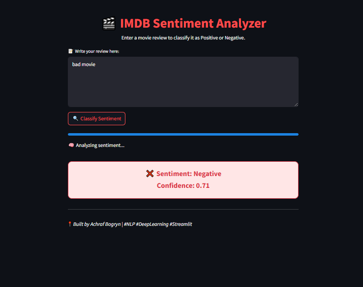

# 📚 Sentiment Analysis on IMDB Reviews using RNN


This project applies Recurrent Neural Networks (RNN) to perform sentiment analysis on movie reviews from the IMDB dataset. The model classifies reviews as either positive or negative based on their textual content.

## 🚀 Project Overview

Sentiment analysis is a key application in Natural Language Processing (NLP) where the goal is to determine the sentiment expressed in a piece of text. In this project, we:

- Preprocessed IMDB review data
- Built and trained an RNN model using TensorFlow/Keras
- Evaluated model performance
- Built a simple Streamlit app to make predictions on user input

## 🛠️ Tools & Technologies

| Tool           | Logo |
|----------------|------|
| Python         |  |
| Pandas         |  |
| NumPy          |  |
| Scikit-learn   |  |
| TensorFlow     |  |
| Streamlit      |  |
| Jupyter Notebook |  |


## 🧠 Model Architecture

- Embedding Layer
- SimpleRNN 
- Dense Output Layer with Sigmoid Activation

## 📊 Dataset

- **Source**: IMDB dataset from Keras datasets (`tensorflow.keras.datasets.imdb`)
- **Content**: 25,000 labeled movie reviews (train) and 25,000 for testing

## 📈 Model Performance

- **Training Accuracy**: 0.98
- **Training Loss**: 0.04

The RNN model was trained on the IMDB dataset and achieved a solid performance in detecting sentiment polarity from reviews. Further tuning or using LSTM/GRU could potentially improve results.


## 🌐 Streamlit App




The app allows users to input their own movie reviews and receive sentiment predictions in real-time.

## 🖥️ Installation & Usage

### 🔹 Clone the repository:

```bash
git clone https://github.com/achraf-bogryn/RNN-Imdb-Sentiment.git
cd RNN-Imdb-Sentiment
```

### 🔹 Install the required packages:
```bash
pip install -r requirements.txt
pip install ipykernel
```

### 🔹 Run the Streamlit App:
```bash
streamlit run main.py
```

### 📦 Project Structure
```bash 
sentiment-analysis-imdb/
│
├── SimpleRnn/main.py                          # Streamlit interface
├── SimpleRnn/imdb_rnn_model.h5                # Saved RNN model
├── images/                                    # Visual assets for README
├── requirements.txt                           # Dependencies
└── README.md
```
